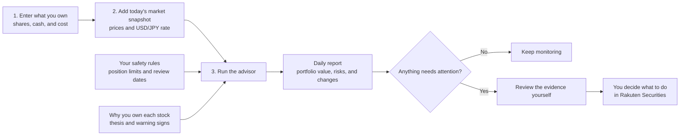

# Stock Market Advisor

An evidence-first research and portfolio-risk agent for a Japan-based beginner investor using Rakuten Securities.

This project is intentionally **not an autonomous trading bot**. It researches candidates, challenges investment theses, monitors portfolio risks, and produces human-readable alerts. Any real order remains a human decision placed through the broker.

## Design principles

1. **Protect capital before finding exciting stocks.**
2. **Primary sources beat social media and summaries.**
3. **A score is not a prediction.** Every conclusion must show evidence, uncertainty, and thesis invalidators.
4. **No fresh data means no action.** Stale or missing data blocks actionable alerts.
5. **Sector-specific reasoning is mandatory.** Biotech, materials, health, and software cannot share one shallow checklist.
6. **Japan-listed single stocks are opt-in.** They require translated primary sources and an explicit confidence penalty when disclosure cannot be verified.
7. **No broker credentials, browser scraping, or unattended orders.**

## Current capabilities

- Strictly validate separate holdings, thesis, market-snapshot, and policy files.
- Normalize USD holdings into a JPY portfolio using explicit timestamped FX observations.
- Flag position, sector, risk-group, speculative, foreign-currency, drawdown, cost-basis, stale-data, and thesis-review risks.
- Generate a private daily Markdown report with position weights, P&L context, currency exposure, and stable finding IDs.
- Remember finding state so persistent risks remain in reports without becoming repeated notification candidates.
- Produce an experimental inspectable candidate score that cannot escalate beyond `RESEARCH`.
- Provide reusable prompts for general equity, biotech/health, materials, and risk analysis.
- Work from any coding agent that can read files and run Node.js.

## User manual

### How the project works



In plain language:

1. You privately record what you own and why you own it.
2. You add current prices and the USD/JPY exchange rate.
3. The software checks your portfolio against your safety rules.
4. It creates a daily report showing concentration, losses, stale data, currency exposure, and overdue reviews.
5. It asks for your attention when something changes. It never buys or sells automatically.

### Requirements

- Windows PowerShell
- Node.js 20 or newer
- No LLM or market-data API key is required for the current local features

The project currently works with manually maintained portfolio and market snapshots. It does not log in to Rakuten, refresh prices automatically, send messages, or place orders.

### 1. Try the demonstration

The repository includes fictional example holdings. These commands do not use your private files:

```powershell
npm.cmd run validate
npm.cmd run risk
npm.cmd run report
```

- `validate` checks that the example files are structurally consistent.
- `risk` prints the complete deterministic risk result as JSON.
- `report` creates a human-readable report under `reports/private/daily/`.

Run the automated checks at any time:

```powershell
npm.cmd test
```

### 2. Create your private workspace

```powershell
npm.cmd run init
```

This creates ignored local files without overwriting existing ones:

```text
data/private/holdings.json
data/private/theses.json
data/private/market-snapshot.json
data/private/policy.json
```

These files and all generated private reports are excluded by `.gitignore`.

Never store Rakuten passwords, MFA codes, account numbers, My Number information, session cookies, or unredacted statements in this repository.

### 3. Enter your holdings

Edit `data/private/holdings.json`.

Each position needs:

| Field | Meaning |
|---|---|
| `id` | Stable unique ID, such as `US:AAPL` |
| `ticker` | Exchange ticker |
| `name` | Human-readable company or fund name |
| `market` | Currently `US` or `JP` |
| `sector` | Economic sector |
| `assetType` | `CommonStock` or `ETF` |
| `quantity` | Number of shares held |
| `instrumentCurrency` | Currently `USD` or `JPY` |
| `costBasisBase` | Total position cost in the portfolio base currency |
| `speculative` | Whether the position belongs to the speculative sleeve |
| `riskGroups` | Shared economic risks, such as `AI_INFRASTRUCTURE` or `BINARY_EVENT` |

`cashBaseValue` is your uninvested cash expressed in the base currency.

### 4. Record the investment thesis

Edit `data/private/theses.json`. Every active holding must have exactly one matching thesis.

Record:

- a short reason for owning it;
- the last completed review date;
- the next review due date;
- thesis status: `ACTIVE`, `WATCH`, or `BROKEN`;
- measurable conditions that would invalidate the thesis.

Example kill criteria include a failed clinical endpoint, a material safety signal, loss of a major customer, or cash runway falling below the next important milestone.

The software stores kill criteria but does not automatically evaluate external events yet.

### 5. Update prices and FX

Edit `data/private/market-snapshot.json`.

For every position, enter:

- current native-currency price;
- highest price observed since entry;
- quote timestamp;
- quote source.

For foreign holdings, also enter the FX rate used for conversion. A USD portfolio position with JPY as the base currency requires `USDJPY`.

This data is currently manual. Check the timestamp before trusting a report.

### 6. Review the policy

Edit `data/private/policy.json`.

The policy controls:

- maximum individual-stock and diversified-fund weights;
- sector and explicit risk-group limits;
- speculative allocation;
- minimum cash;
- foreign-currency exposure;
- drawdown and cost-basis review thresholds;
- stale-price window;
- thesis-review reminders;
- reporting timezone.

The included limits are conservative examples—not personalized financial advice.

### 7. Validate private data

Always validate after editing:

```powershell
npm.cmd run validate:private
```

Validation rejects:

- unknown or misspelled fields;
- invalid dates, currencies, and asset types;
- negative or non-finite values;
- duplicate position IDs;
- holdings without matching theses or quotes;
- ticker or currency mismatches;
- missing FX rates;
- unsafe or inconsistent policy values.

Fix every validation error before using a report.

### 8. Inspect the risk result

```powershell
npm.cmd run risk:private
```

This prints JSON containing:

- portfolio value in JPY;
- position weights;
- unrealized P&L context;
- JPY/USD exposure;
- sector and economic risk-group exposure;
- active findings with stable IDs.

The engine currently checks:

- individual-position concentration;
- diversified-fund concentration;
- sector concentration;
- explicit correlated risk groups;
- speculative allocation;
- foreign-currency exposure;
- low cash;
- drawdown from peak;
- loss relative to cost basis;
- stale quote data;
- thesis reviews due soon or overdue;
- theses explicitly marked `BROKEN`;
- unsafe policy configuration.

A drawdown or cost-basis loss requests investigation. It is not an automatic sell signal.

### 9. Generate the daily report

Use the Windows helper:

```powershell
powershell.exe -ExecutionPolicy Bypass -File scripts\run-daily-report.ps1
```

Or run:

```powershell
npm.cmd run report:private
```

The following ignored files are generated:

```text
reports/private/daily/YYYY-MM-DD.md
reports/private/risk-findings.json
reports/private/finding-state.json
```

The Markdown report contains:

- portfolio summary;
- currency exposure;
- position values, weights, P&L, prices, and review dates;
- all unresolved findings;
- notification candidates;
- safety and data-quality notes.

Persistent findings remain visible every day. A finding becomes a notification candidate only when it is new, reopened, or escalated. Actual email or Telegram delivery is not implemented yet.

### 10. Use the experimental candidate score

```powershell
npm.cmd run score -- --candidate data/candidate.example.json
```

The score shows how a transparent weighted calculation works, but its factor values are manually supplied and uncalibrated. It always returns `RESEARCH` and must not be treated as a recommendation.

### 11. Use the specialist research prompts

The `prompts/` directory contains checklists that Codex, Claude Code, Gemini, or another agent can apply during manual research:

- `general-equity-analyst.md`
- `biotech-health-specialist.md`
- `materials-specialist.md`
- `risk-officer.md`

These prompts help structure analysis but are not yet connected to an automated evidence pipeline. Always provide current primary sources and verify every material claim.

### 12. Schedule a local report

After private values reconcile with Rakuten and the manual report is useful, schedule:

```text
scripts/run-daily-report.ps1
```

with Windows Task Scheduler.

Scheduling does not refresh prices or FX. A scheduled report using an old market snapshot should produce stale-data findings, but it cannot obtain fresh data by itself.

### Common statuses

| Status | Meaning |
|---|---|
| `RESEARCH` | Evidence is incomplete or analysis remains experimental |
| `WATCH` | Monitor or review; no immediate action implied |
| `HUMAN_REVIEW` | A person should assess the evidence and portfolio fit |
| `RISK_REVIEW` | One or more portfolio or data-quality findings need attention |
| `THESIS_BROKEN` | A predefined thesis invalidator appears to have occurred; still requires human review |

### Troubleshooting

- **Missing private file:** run `npm.cmd run init`.
- **Validation failure:** read every listed field path and correct the private JSON.
- **Stale-price finding:** update quote and FX timestamps with a trustworthy source.
- **Repeated report findings:** expected until the condition is resolved; repeated push candidates are suppressed.
- **Unexpected JPY value:** verify quantity, native price, `USDJPY`, cost basis, and timestamps.
- **No fresh market information:** expected; automatic market-data ingestion is the next milestone.

For a more detailed private-data explanation, see [docs/PRIVATE_DATA_SETUP.md](docs/PRIVATE_DATA_SETUP.md).

## Intended workflow

```text
Primary sources + licensed market data
                 |
          Evidence collector
                 |
   Analyst / Sector specialist / Skeptic
                 |
          Deterministic risk gate
                 |
      Research memo or risk alert
                 |
          Human approves action
                 |
          Rakuten Securities
```

## What to build next

See [docs/SYSTEM_PLAN.md](docs/SYSTEM_PLAN.md). The local daily-report slice now works; the next milestone is one trusted market-data adapter so prices and FX observations no longer require manual updates. Broker integration remains later and human-approved.

The project’s evolving problem statement, comparative research, implementation progress, experiments, and lessons are maintained in [docs/DEVELOPMENT_REPORT.md](docs/DEVELOPMENT_REPORT.md).

## Important notice

This software is for research and decision support, not individualized financial, tax, or legal advice. Markets can lose value quickly, and no model can reliably identify all opportunities or sell risks in advance.
